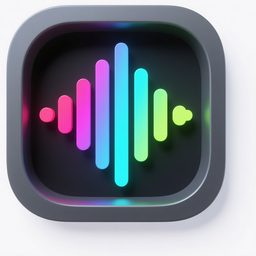

<p align="center">
  
</p>

<h1 align="center">Barglow</h1>

<p align="center">
  适用于 Windows 11 的任务栏音频可视化工具<br>
  <a href="README.md">English</a>
  ·
  <a href="https://github.com/huangcheng/Barglow/releases">发布页</a>
  ·
  <a href="LICENSE">MIT 许可证</a>
</p>

---

Barglow 通过 WASAPI 回环采集系统音频，在 Windows 11 任务栏上绘制半透明 RGB 频谱条。程序驻留托盘，尽量不打扰日常使用，并在全屏应用覆盖任务栏时自动隐藏。

## 功能

- 实时频谱柱与峰值帽（WASAPI 回环 + FFT）
- 饱和 LED 风格 RGB 色带
- Overlay 宿主跟随主任务栏几何 / DPI / 自动隐藏
- 强度：轻柔 / 适中 / 响亮；主题：跟随系统 / 强制深色 / 强制浅色
- 英文 + 简体中文界面
- 支持开机启动
- 全屏应用覆盖任务栏时自动隐藏

## 系统要求

- Windows 11（x64）
- 从源码编译需 Visual Studio 2022+，并安装「使用 C++ 的桌面开发」工作负载

## 安装

1. 从 [Releases](https://github.com/huangcheng/Barglow/releases) 下载最新 `Barglow.exe`
2. 运行后托盘出现图标
3. 右键托盘图标 → **设置** / **关于** / **退出**

无需安装包。配置保存在 `%AppData%\Barglow\settings.ini`。

## 编译

```bat
msbuild Barglow.vcxproj /p:Configuration=Release /p:Platform=x64
```

输出：`x64\Release\Barglow.exe`

## 使用

| 操作 | 效果 |
| --- | --- |
| 双击托盘图标 | 打开设置 |
| 右键托盘 | 设置 / 关于 / 退出 |
| 设置 → 强度 | 轻柔 / 适中 / 响亮 |
| 设置 → 主题 | 跟随系统 / 强制深色 / 强制浅色 |
| 设置 → 语言 | 跟随系统 / English / 简体中文 |
| 启用可视化 | 开关频谱条 |
| 开机启动 | 写入 HKCU Run |

## 截图

<p align="center">
  
</p>

## 许可证

[MIT](LICENSE) © HUANG Cheng

仓库：https://github.com/huangcheng/Barglow
